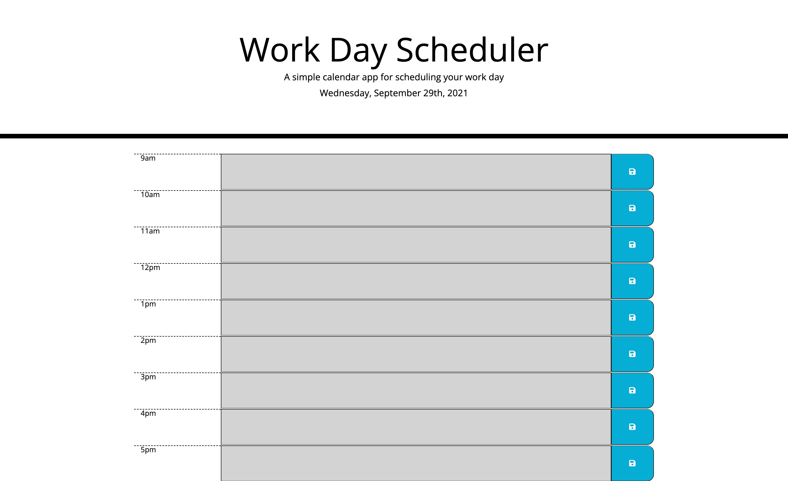

# Homework 5: work-day-scheduler
## Objective:

The objective of this assignment was to use jQuery to add functionality to the planner and bootstrap to style the page. I was given the header in the index.html as well as the CSS file to use. The goal was to create a work day planner that allows the user to enter items into each time block, save it and have it persist on the page as well as the ability to add more events. I also had to set rules have the timeblocks in the past have a background color of grey, the current time-slot was to be red and future time-slots green. 

To start, I created all of the rows with the time block, input section and save button in the HTML. Next I added the classes to each section using both Boot Strap and the given CSS file. Next, I created functions using jQuery to save and retrieve the notes the user enters to local storage. After that, I created a function to color the time blocks according to whether it is in the past, present or future. The last thing I did was to create a function to set the day and date to the header. 

## Screenshot of Homepage

## Link to deployed code
https://kesjoberg.github.io/work-day-scheduler/
